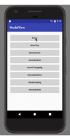

# ModalView
Android ModalView for Enhance Dialog.


# Demo


# Usage

```
    //一般使用，默认有动画（Animation实现）
    show(anim: Boolean = true)
    dismiss(anim: Boolean = true)
    
    //自定义显示、显示动画
    showWithAnimation(anim: Animation)
    dismissWithAnimation(anim: Animation)
    
    //实验
    showWithAnimator(animator: ObjectAnimator)
    dismissWithAnimator(animator: Animator)
    
    //Basic
    val modalView = ModalView(this).with {
        contentView = view
    }
    modalView.show()    //show
    modalView.dismiss() //dismiss
```

# Attribute

```
    /*显示View*/
    contentView: View
    /*弹窗背景颜色*/
    var backgroundResource = R.color.modal_mask
    /*弹窗距离两侧的距离(dp)*/
    var margin: Int = 44
    /*当前是否显示*/
    var isShowing = false
    /*显示位置*/
    var position = POSITION_BOTTOM
    /*ModalView视图宽、高*/
    var width = MATCH_PARENT
    var height = WRAP_CONTENT
```

# Dependency

```
   dependencies {
     compile 'com.changjiashuai.modalview:modalview:1.0.3'
   }
```

# License